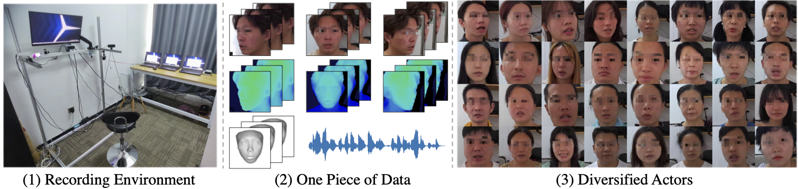

## MMFace4D: A Large-Scale Multi-Modal 4D Face Dataset for Audio-Driven 3D Face Animation
------
Haozhe Wu, Jia Jia, Junliang Xing, Hongwei Xu, Xiangyuan Wang, Jelo Wang
[[Paper]](https://arxiv.org/abs/2303.09797)




This repo gives the official code of the paper MMFace4D. The source code of 4D reconstruction, mesh sequence compression, and face animation baseline is given.

### MMFace4D Dataset Structure
------

We give the camera intrinsics, facial landmarks, speech audio, depth sequence, and 3D reconstructed sequence in the MMFace4D dataset. Each part is organized as follows:

**Camera Intrinsics**: The camera intrinsics give the intrinsic matrix of each camera, which has the same format as the API of Azure Kinect. The intrinsics matrices of each sequence are saved.

**Facial Landmarks**: We detect 2D facial landmarks of each video with HRNetv2. The landmarks of each video are saved as pickle format, which has shape (frame_num * 98 * 3).

**Speech Audio**: The speech audio is saved as wav format. Notice that for one recording, we have three videos from three perspectives, but we only have one speech audio.

**Depth Sequence**: the depth video is compressed as nut format with uint16. We can leverage ffmpeg to decode it. Here we give an example of decoding:

```python
import ffmpeg
import numpy as np
out, _ = (
    ffmpeg
    .input(depth_path)
    .output('pipe:', format='rawvideo', pix_fmt='gray16le', loglevel="quiet")
    .run(capture_stdout=True)
)
video = np.frombuffer(out, np.uint16).reshape([-1, 1080, 1920]).copy()
```


**3D Reconstructed Sequence**: the 3D reconstructed sequence are also compressed as nut files. Each 3D sequence is compressed to three nut files. Our algorithm compress 3D mesh sequence with the same topology. Here we give an example of a compresses vertices to nut files:

*Encode*
```python
from mesh_compression.encode import SequenceEncoder
encoder = SequenceEncoder('test_data/test', number_of_vertex)   # we have three video files, test_data/test_{0, 1, 2}.nut
for i in range(len(vertex_sequences)): # vertex_sequences has shape of frame_num * num_vertex * 3
    frame = vertex_sequences[i]
    encoder.write_frame(frame)

encoder.close()
```

*Decode*
```python
from mesh_compression.decode import decode_nut_to_np
vertices = decode_nut_to_np('./test_data/test', number_of_vertex)
```

### Environments
------

For offline render, we need to install OSMesa, please follow the instructions of [pyrender](https://pyrender.readthedocs.io/en/latest/install/index.html)

For the differential render, we leverage nvdiffrast, please follow the instructions of [nvdiffrast](https://github.com/NVlabs/nvdiffrast)

Afterwards, run the other environments with 
`pip install -r requirements.txt`

### 4D Reconstruction
------

The reconstruction code is implemented in the `reconstruction` folder. We respectively provide the code of reconstructing 3D faces from three RGBD cameras and one RGBD camera.

For three-camera reconstruction, run

`python multicam_reconstruction.py --file_path ../test_data/000337 --save_path ../test_data/000337_save --faces_path ../test_data/faces.pkl`

For one-camera reconstruction, run

`
python singlecam_reconstruction.py --file_path ../test_data/000337 --save_path ../test_data/000337_save --faces_path ../test_data/faces.pkl
`

After reconstruction, we leverage low pass filter to smooth the reconstructed results. The code is provided in `smooth_4d.py`. For example, run

`
python smooth_4d.py --file_path ../test_data/000337 --out_path ../test_data/000337_filt
`


### Preprocess Azure Kinect RGBD files
------
With the recorded MKV files of azure kinect, we decode it to nut files, mp4 files, and wav files. The nut files records depth video, mp4 files record RGB video, wav files record audio.
The preprocess code is provided in `process_mkv.py`. 
For people who wants to collect your own data, you can use this code for reference.

### Visualize 3D Sequences
------
We visualize nut files in `reconstruction/visualize_nut.py`. Run `python visualize_nut.py --file_path {} --out_path {}` provides the visualization mp4 video. See `reconstruction/visualize.sh` for example.

### License and Citation
------
```
@article{wu2023mmface4d,
  title={MMFace4D: A Large-Scale Multi-Modal 4D Face Dataset for Audio-Driven 3D Face Animation},
  author={Wu, Haozhe and Jia, Jia and Xing, Junliang and Xu, Hongwei and Wang, Xiangyuan and Wang, Jelo},
  journal={arXiv preprint arXiv:2303.09797},
  year={2023}
}
```